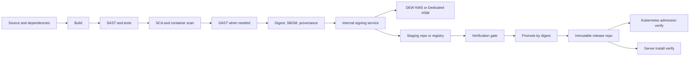
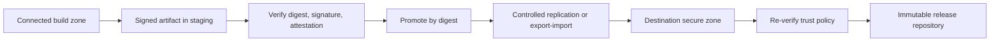

# 10 Target Architecture

## Document control

| Field | Value |
|---|---|
| Document | 10 Target Architecture |
| Version | 0.3.1-draft |
| Date | 2026-03-26 |
| Status | Working draft |
| Change owner | Architecture working draft |

## Change history

| Version | Date | Summary |
|---|---|---|
| 0.1-draft | 2026-03-26 | Initial target architecture and controls. |
| 0.2-draft | 2026-03-26 | Updated architecture to place Huawei DEW KMS or Dedicated HSM at the trust boundary and added direct versus adapter-based integration guidance. |
| 0.3-draft | 2026-03-26 | Added architecture note distinguishing official published guidance from custom Huawei-private-cloud integration work. |
| 0.3.1-draft | 2026-03-26 | Aligned with the richer guidance matrix and clarified open-source-first but commercial-fallback design stance. |

## Scope

This document defines the target control model for signing, promotion, replication, and deployment enforcement.

## Recommended target state

The recommended target state for Huawei private cloud is to host CI/CD, Harbor or Nexus, and a central signing service inside Huawei private cloud, while keeping private keys in DEW KMS or Dedicated HSM.

Where direct product integration is not available, the signing service acts as the adapter between build pipelines and Huawei-managed key custody.

## Control model

The target model is:
1. Build artifact.
2. Run required security checks.
3. Generate digest.
4. Generate SBOM and provenance.
5. Create signed release attestation.
6. Request signature from internal signing service.
7. Publish to staging.
8. Verify and promote by digest.
9. Replicate to secure environment.
10. Re-verify before release.
11. Enforce runtime trust.

## Core systems

| System | Role | Preferred Huawei-private-cloud deployment |
|---|---|---|
| CI/CD platform | Build, test, and orchestrate promotion | Self-hosted on Huawei VMs or Kubernetes |
| Security scanners | Generate release evidence | Self-hosted or connected scanners in the build zone |
| Signing service | Accept approved signing requests and mediate access to keys | Small internal API or central signing service hosted on VMs or containers |
| Signing tools | Sign artifacts and attestations | Cosign, Notation, SignServer CE, rpmsign, dpkg-sig, debsign, SignTool |
| Metadata tools | Produce signed release evidence | in-toto, SBOM generator, provenance generator |
| Artifact repository | Store and promote releases | Harbor, Nexus OSS, Nexus Pro |
| Key custody | Protect signing keys | Huawei DEW KMS or Huawei Dedicated HSM |
| Runtime enforcement | Block untrusted deployment | Sigstore policy-controller, package verification, OS allow-listing |

## Integration patterns

### Pattern 1: KMS-backed signing API

Use when the signing tool does not have documented native Huawei KMS support.

How it works:
- CI/CD calls an internal signing API with artifact digest and approved metadata.
- The signing API authenticates the request, calls Huawei KMS signing or verification functions, and returns the signed payload or signed attestation.
- Repositories store artifact, signature, and attestation together.

Best for:
- Cosign-based environments.
- Mixed artifact types.
- Easier central policy enforcement.

### Pattern 2: Dedicated HSM plugin or adapter

Use when the tool can work through PKCS#11, CSP, or an external signing plugin.

How it works:
- A plugin or integration component talks to Huawei Dedicated HSM.
- The signing tool uses the plugin to generate raw or envelope signatures without exposing the private key.
- Verification policies remain in the repository or runtime platform.

Best for:
- Notation-based OCI signing.
- Future enterprise PKI integration.
- Stronger hardware separation.

### Pattern 3: Central signing broker

Use when multiple tools and teams need one signing workflow.

How it works:
- The broker exposes a standard signing request API.
- Different back-end workers sign OCI, Linux, and Windows artifacts with tool-specific logic.
- All workers use Huawei KMS or Dedicated HSM as the trust anchor.

Best for:
- Large mixed environments.
- Shared control over release approvals and auditing.
- Separation of duties between platform, security, and development teams.

## Mandatory controls

- Release repositories and projects must be immutable.
- Production releases must be promoted from staging, never rebuilt in place.
- All production artifacts must have a verifiable signature.
- All production artifacts must have associated release metadata.
- Replicated artifacts must be re-verified in the destination environment.
- Runtime platforms must reject unsigned or untrusted artifacts.
- Build workers must not hold long-lived private signing keys.

## Metadata model

A signed release attestation should include:
- Artifact digest.
- Artifact type.
- Build ID and pipeline run.
- Source repository and commit.
- Builder identity.
- SBOM location and hash.
- SCA verdict.
- SAST verdict.
- DAST verdict where applicable.
- Vulnerability waiver or exception ID if used.
- Release approver and change ticket.
- Release date.
- Target environment.

## Replication pattern

The safer transfer model is to move artifacts from the connected build zone into a more secure release zone by digest, while transferring the related signature and attestation objects together.

## Kubernetes controls

Kubernetes should only admit images that:
- Are signed by approved identities.
- Match allowed repositories.
- Carry required attestations.
- Meet policy on scan status and critical findings.

Typical enforcement points:
- Admission controller verification.
- Namespace-specific trust policy.
- Image digest pinning.
- Restriction on pulling from non-approved registries.

## Server deployment controls

For non-container deployment, controls should include:
- Signed package repositories.
- Package verification before install.
- Binary signature verification where package managers are not used.
- Restricted software sources.
- Change-controlled promotion from staging to release repositories.
- Execution control or allow-listing for trusted publishers.

## Published guidance versus custom integration

The target architecture should assume two categories of controls:
- Officially documented product behavior such as Harbor signing workflows, Huawei DEW capabilities, Huawei image signing and verification features, Nexus repository controls, and Sigstore policy-controller verification.
- Custom integration work such as connecting Cosign, Notation, or SignServer CE to Huawei-controlled key custody when no native Huawei-specific guide exists.

| Area | Use published guidance directly | Plan custom integration work |
|---|---|---|
| DEW KMS and Dedicated HSM setup | Yes | No |
| Harbor artifact signing workflow | Yes | Only for Huawei-specific key path |
| Nexus release repository controls | Yes | Only for Huawei-specific signing path and metadata handling |
| Cosign with Huawei key custody | Partly | Yes |
| Notation with Huawei key custody | Partly | Yes |
| SignServer CE with Huawei key custody | Partly | Yes |

## Decision notes

- Use Harbor-first when most releases are OCI artifacts.
- Use Nexus-first when package formats dominate.
- Use Huawei DEW-backed signing when key isolation and centralized trust are primary requirements.
- Prefer adapter-based integration when a tool does not document native Huawei KMS support.
- Prefer Dedicated HSM for plugin-based or hardware-backed signing patterns.

## Reference links

| Topic | Reference | Link |
|---|---|---|
| Harbor signing and verification | Harbor docs | [https://goharbor.io/docs/2.13.0/working-with-projects/working-with-images/sign-images/](https://goharbor.io/docs/2.13.0/working-with-projects/working-with-images/sign-images/) |
| Huawei DEW capabilities | DEW Service Overview PDF | [https://support.huaweicloud.com/intl/en-us/productdesc-dew/dew-productdesc-pdf.pdf](https://support.huaweicloud.com/intl/en-us/productdesc-dew/dew-productdesc-pdf.pdf) |
| Cosign KMS support | Cosign KMS provider overview | [https://docs.sigstore.dev/cosign/key_management/overview/](https://docs.sigstore.dev/cosign/key_management/overview/) |
| Sigstore policy-controller | Policy Controller Overview | [https://docs.sigstore.dev/policy-controller/overview/](https://docs.sigstore.dev/policy-controller/overview/) |
| in-toto attestation | in-toto docs | [https://github.com/in-toto/attestation/blob/main/docs/README.md](https://github.com/in-toto/attestation/blob/main/docs/README.md) |
| Notation plugin model | Notary Project plugin extensibility | [https://github.com/notaryproject/specifications/blob/main/specs/plugin-extensibility.md](https://github.com/notaryproject/specifications/blob/main/specs/plugin-extensibility.md) |
| SignServer CE | SignServer Community | [https://www.signserver.org](https://www.signserver.org) |
| Nexus Firewall | Sonatype Repository Firewall | [https://help.sonatype.com/en/repository-firewall.html](https://help.sonatype.com/en/repository-firewall.html) |
| Nexus SBOM | Sonatype SBOM docs | [https://help.sonatype.com/en/software-bill-of-materials-sbom.html](https://help.sonatype.com/en/software-bill-of-materials-sbom.html) |
