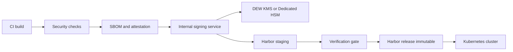
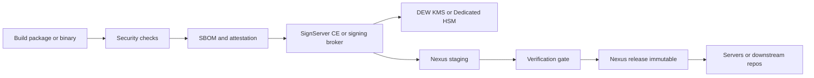
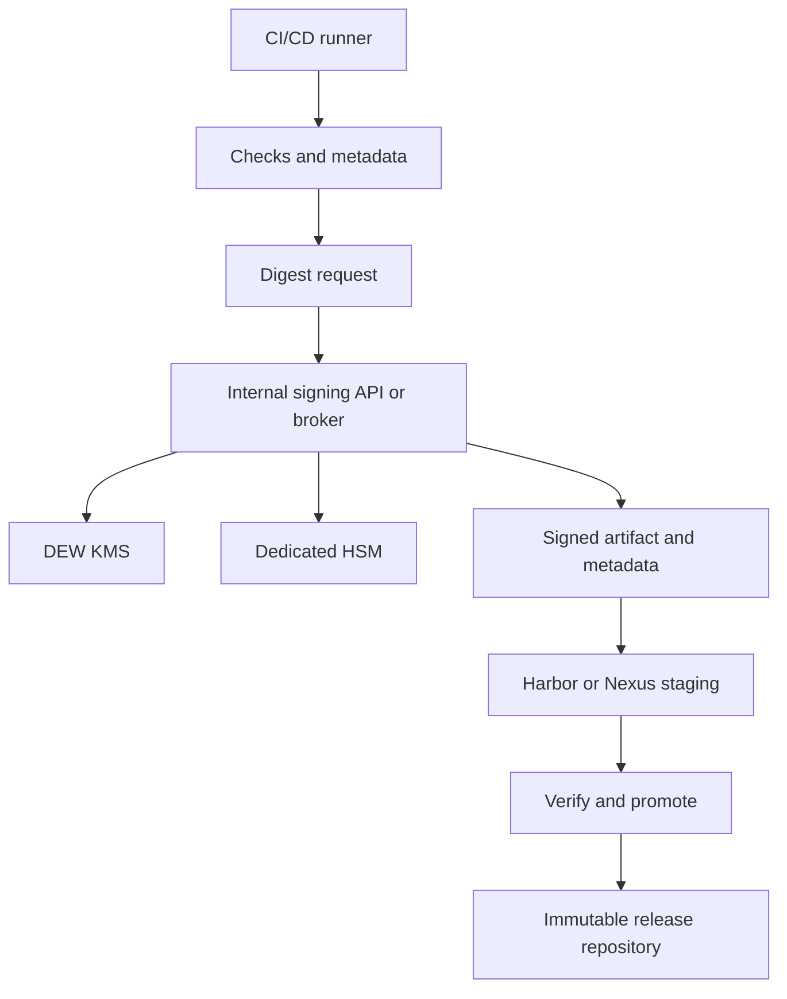

# 20 Implementation One-Pagers

## Document control

| Field | Value |
|---|---|
| Document | 20 Implementation One-Pagers |
| Version | 0.3.1-draft |
| Date | 2026-03-26 |
| Status | Working draft |
| Change owner | Architecture working draft |

## Change history

| Version | Date | Summary |
|---|---|---|
| 0.1-draft | 2026-03-26 | Initial one-pagers for Harbor-first, Nexus-first, and Huawei DEW-backed patterns. |
| 0.2-draft | 2026-03-26 | Reworked all one-pagers to leverage Huawei DEW KMS or Dedicated HSM for signing key custody and added versioned design notes. |
| 0.3-draft | 2026-03-26 | Added implementation guidance on where official product guidance ends and custom Huawei integration begins. |
| 0.3.1-draft | 2026-03-26 | Added explicit open-source-first and commercial fallback guidance for enterprise artifact signing on premises. |

## 1. Harbor-first implementation example

### Summary

Use Harbor as the release control point for containers and OCI artifacts, but keep signing keys in Huawei private cloud key services. Sign all release images with Cosign or Notation, attach release attestations, and use Harbor staging and release projects with immutability enabled.

### Systems and tools

| Area | Recommended tools |
|---|---|
| Registry | Harbor |
| OCI signing | Cosign or Notation |
| Metadata and attestations | in-toto plus SBOM generator |
| Signing integration | Internal signing service backed by DEW KMS, or Notation plugin backed by Dedicated HSM |
| Cluster enforcement | Sigstore policy-controller |

### Design notes

- Use Cosign when the team wants a simple OCI signature workflow and can place a Huawei-backed signing API in front of KMS.
- Use Notation when the team wants to invest in a plugin model for remote KMS or PKCS#11-oriented signing.
- Do not store private keys on CI workers or inside Harbor.

### Process

1. Build image and calculate digest.
2. Run SAST, SCA, container scan, and DAST if required.
3. Generate SBOM and release attestation.
4. Request signature from the internal signing path.
5. Push signed image, signature, and attestation to Harbor staging project.
6. Verify signature and attestation.
7. Promote by digest to Harbor release project.
8. Replicate to secure Harbor if required.
9. Re-verify at destination before deployment.

### Gates

- No unsigned image can be promoted.
- No mutable tag can be treated as a release identifier.
- Only the release project can be used by production clusters.
- Admission policy must reject images without approved signatures and evidence.

## 2. Nexus-first implementation example

### Summary

Use Nexus for mixed software delivery, especially RPM, DEB, installers, archives, and selected containers. Separate intake, staging, and release repositories, and prevent redeploy into release repositories while keeping signing keys in Huawei-managed custody.

### Systems and tools

| Area | Recommended tools |
|---|---|
| Repository | Nexus OSS or Nexus Pro |
| Central signing | SignServer CE or internal signing broker |
| RPM signing | rpmsign |
| Debian signing | dpkg-sig or debsign |
| Windows signing | SignTool |
| Metadata | SBOM files plus signed release attestation |
| Key custody | DEW KMS or Dedicated HSM |
| Advanced policy | Repository Firewall and IQ if licensed |

### Design notes

- The safest pattern is to sign packages and binaries through a central broker that is hosted in Huawei private cloud and protected by Huawei key custody.
- The release repository should remain a promotion target, not the place where signing happens.
- Package-native trust still matters even if additional release attestations are stored alongside the artifact.

### Process

1. Build package or binary.
2. Run required security checks.
3. Generate digest, SBOM, and release attestation.
4. Send signing request to SignServer CE or a signing broker backed by Huawei KMS or Dedicated HSM.
5. Publish to Nexus staging repository.
6. Verify signatures and metadata completeness.
7. Promote to non-redeployable release repository.
8. Distribute only from the release repository.

### Gates

- Release repository must be non-redeployable.
- Promotion requires signature verification.
- Promotion requires signed release metadata.
- Production systems may only install from approved release repositories.

## 3. Huawei DEW-backed implementation example

### Summary

Use Huawei DEW as the root of trust and make Harbor or Nexus the storage and promotion layer. This is the recommended pattern when CI/CD and repositories are hosted inside Huawei private cloud and strong key isolation is required.

### Systems and tools

| Area | Recommended tools |
|---|---|
| Key custody | Huawei DEW KMS or Dedicated HSM |
| Signing API | Internal lightweight signing service or signing broker |
| OCI signing | Cosign through signing API, or Notation through plugin or adapter |
| Package signing | SignServer CE, rpmsign, dpkg-sig, debsign, SignTool |
| Repository | Harbor or Nexus |
| Runtime gate | Sigstore policy-controller and package verification |

### Preferred variants

#### Variant A: DEW KMS broker

Use this when you want one central API and the least custom logic in the CI/CD platform.

#### Variant B: Dedicated HSM plugin path

Use this when you want stronger HSM-style integration and the signing tool can use an external plugin or adapter.

### Process

1. CI builds artifact and runs checks.
2. CI sends only digest and approved metadata payload to the signing service.
3. Signing service uses DEW KMS or Dedicated HSM for signing.
4. Signed artifact and signed metadata are pushed to staging.
5. Promotion gate verifies trust policy.
6. Approved release is promoted to immutable release storage.

### Gates

- CI workers cannot access private keys directly.
- Only approved pipelines can call the signing API.
- The signing API accepts only digest-based signing requests.
- All releases are traceable through signing and repository audit logs.

## Open-source-first stance

The preferred implementation is to keep the service on premises or in Huawei private cloud and use open-source tools first.

Recommended default stack:
- Harbor plus Cosign or Notation for OCI artifacts.
- Nexus OSS or Harbor for repository control.
- SignServer CE plus native package-signing tools for RPM, DEB, and Windows outputs.
- Huawei DEW KMS or Dedicated HSM for signing key custody.
- Sigstore policy-controller for Kubernetes admission checks.

Commercial fallback examples:
- Venafi CodeSign Protect for governed HSM-backed code signing.
- DigiCert Software Trust Manager for hash-signing and tool integrations.
- SignPath for managed signing workflows and crypto-provider integrations.

## Published guidance boundary

Use vendor or project documentation directly for these areas:
- Huawei DEW KMS and Dedicated HSM setup and operations.
- Harbor signing workflows with Cosign or Notation.
- Huawei SWR and CCE image signing and verification capabilities where applicable.
- Nexus repository control patterns such as staging, release separation, and non-redeployable releases.

Plan custom engineering for these areas:
- A Huawei-aware signing broker for Cosign.
- A Notation plugin or adapter for Huawei KMS or Dedicated HSM.
- A SignServer CE integration pattern that keeps keys behind Huawei-managed custody.
- Consistent metadata and attestation packaging across Harbor and Nexus.

## Editing notes

Recommended next refinements:
- Add current tool owners and system names.
- Add actual environment names and network zones.
- Add current scanners and approval workflow.
- Decide one primary attestation format.
- Decide one promotion process per artifact class.
- Decide whether KMS broker or Dedicated HSM plugin becomes the standard pattern.

## Reference links

| Topic | Reference | Link |
|---|---|---|
| Harbor signing | Harbor docs | [https://goharbor.io/docs/2.13.0/working-with-projects/working-with-images/sign-images/](https://goharbor.io/docs/2.13.0/working-with-projects/working-with-images/sign-images/) |
| Cosign KMS support | Cosign KMS provider overview | [https://docs.sigstore.dev/cosign/key_management/overview/](https://docs.sigstore.dev/cosign/key_management/overview/) |
| SignServer CE | SignServer Community | [https://www.signserver.org](https://www.signserver.org) |
| Notation plugin model | Notary Project plugin extensibility | [https://github.com/notaryproject/specifications/blob/main/specs/plugin-extensibility.md](https://github.com/notaryproject/specifications/blob/main/specs/plugin-extensibility.md) |
| in-toto | in-toto attestation docs | [https://github.com/in-toto/attestation/blob/main/docs/README.md](https://github.com/in-toto/attestation/blob/main/docs/README.md) |
| Huawei DEW | DEW Service Overview PDF | [https://support.huaweicloud.com/intl/en-us/productdesc-dew/dew-productdesc-pdf.pdf](https://support.huaweicloud.com/intl/en-us/productdesc-dew/dew-productdesc-pdf.pdf) |
| Kubernetes gate | Sigstore Policy Controller | [https://docs.sigstore.dev/policy-controller/overview/](https://docs.sigstore.dev/policy-controller/overview/) |
| RPM signing | rpmsign manual | [https://man7.org/linux/man-pages/man8/rpmsign.8.html](https://man7.org/linux/man-pages/man8/rpmsign.8.html) |
| Debian signing | dpkg-sig manual | [https://manpages.debian.org/stretch/dpkg-sig/dpkg-sig.1.en.html](https://manpages.debian.org/stretch/dpkg-sig/dpkg-sig.1.en.html) |
| Windows signing | Microsoft SignTool docs | [https://learn.microsoft.com/en-us/windows/win32/seccrypto/signtool](https://learn.microsoft.com/en-us/windows/win32/seccrypto/signtool) |
| Nexus controls | Sonatype Repository Firewall | [https://help.sonatype.com/en/repository-firewall.html](https://help.sonatype.com/en/repository-firewall.html) |
